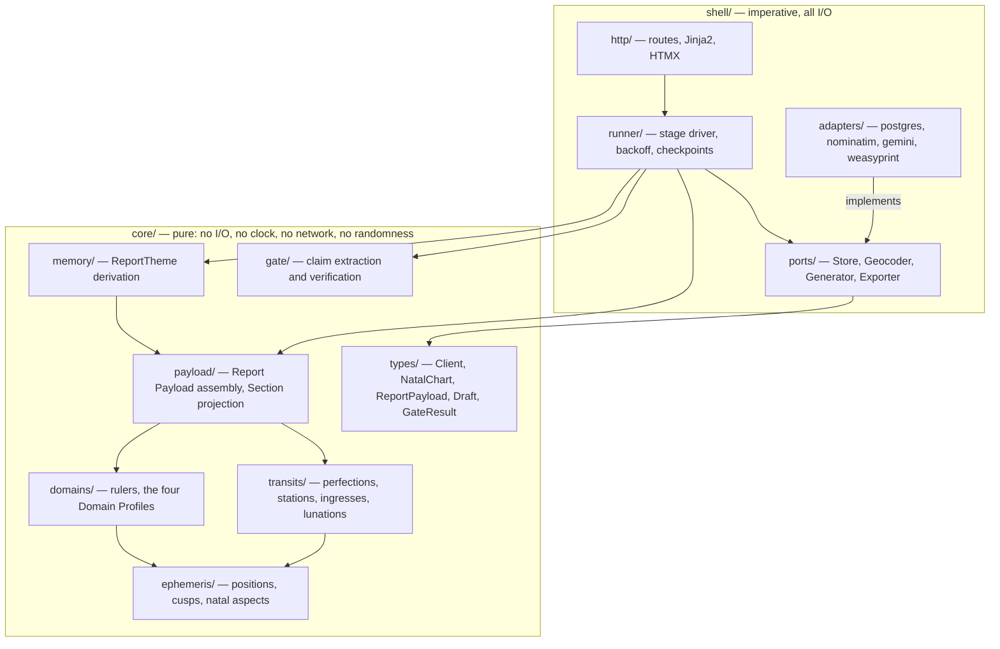
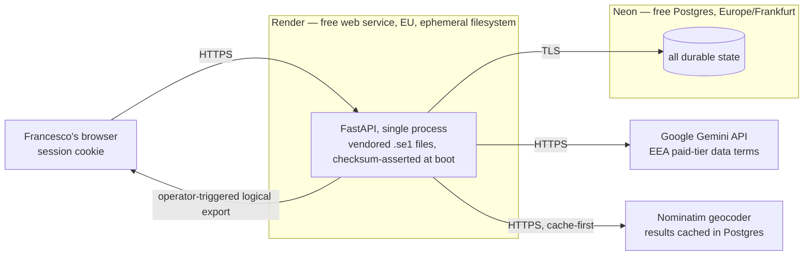
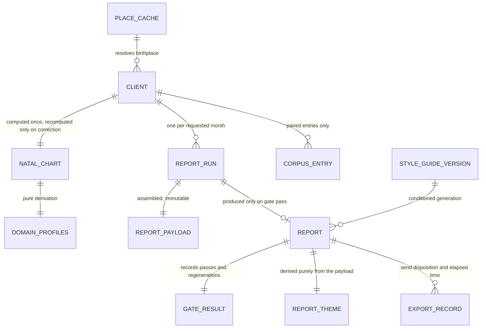

# Architecture Spine — astro-report

## Design Paradigm

**Functional core, imperative shell.**

Every astronomical computation, every derivation and every verification is a pure function in
`core/`. Everything that touches the world — database, geocoder, language model, PDF writer, HTTP,
and the clock — lives in `shell/`. The PRD's central guarantees are not rules to remember under this
paradigm; they are consequences of where code lives.

| PRD guarantee | How the paradigm produces it |
| --- | --- |
| Byte-identical Report Payload (§5) | The assembling code has no access to a clock, a network or a database |
| The Generator computes nothing (§6.1) | The model is reached only from `shell/`, which `core/` cannot import |
| Claim-level determinism (§4.6) | The Gate is a pure function of draft and Payload |
| Retry and resume cost nothing (FR-19, FR-21) | Re-running a pure stage on the same input is free and identical |

Inside the core, report production is an explicit pipeline of named stages. Inside the shell,
external systems are reached through ports.

**The dependency rule:** `shell/` imports `core/`. `core/` imports nothing from `shell/`, ever. That
single grep is the architecture test.



No arrow runs from `core` to `shell`. There is no exception.

## Invariants & Rules

### AD-1 — The purity boundary, and its one declared exception

- **Binds:** all
- **Prevents:** astronomy or Payload assembly quietly acquiring a dependency on wall-clock time,
  network state or database state — which would break the byte-identical-Payload NFR silently, and
  would make it possible to invoke the Generator from inside computation.
- **Rule:** `core/` contains only pure functions: no I/O, no clock, no network, no randomness, no
  environment reads, and no import from `shell/`. The shell loads data, calls core functions, and
  persists what they return. **The single declared exception is the ephemeris**: Kerykeion and
  pyswisseph read the vendored `.se1` files from disk inside `core/ephemeris/`, permitted only
  because AD-2 makes them a pinned, read-only, checksum-verified deterministic oracle. Positions
  cannot be hoisted into the shell because locating perfections, stations, ingresses and lunations
  requires iterative bisection over arbitrary instants. A second exception is a spine amendment, not
  a judgement call. An import-boundary test enforces this rule in CI.

### AD-2 — Ephemeris identity is pinned, asserted at boot, and recorded in every Payload

- **Binds:** FR-3, FR-8–FR-12, FR-14, NFR computational determinism, SM-3
- **Prevents:** pyswisseph silently selecting a different ephemeris depending on which files it finds
  on disk, so the same code yields different numbers on different deployments — and a station or cusp
  crossing near midnight lands on the wrong day, which is the deliverable.
- **Rule:** `sepl_18.se1` and `semo_18.se1` are vendored in the repository. The shell calls
  `swe.set_ephe_path()` explicitly at startup, verifies each file against a pinned SHA-256, and
  refuses to start on a missing file or a checksum mismatch. The Moshier fallback is never an
  accepted runtime state. Every Report Payload records the ephemeris file identity that produced it.

### AD-3 — The Report Payload is the Generator's only channel

- **Binds:** FR-13–FR-18, FR-20, §6.1
- **Prevents:** a second path — a database read, a tool call, retrieved text, a prior Report's prose —
  supplying the model an astronomical fact that the Gate has no entry to check against.
- **Rule:** the `Generator` port accepts exactly `(ReportPayload, StyleGuide, ReportTheme_previous,
  ReportTheme_current)` and nothing else. Its adapter holds no database handle, no filesystem access
  and no tool definitions. Anything a Section needs must enter through Payload assembly. Prior Report
  prose is never sent to the Generator; continuity travels as `ReportTheme` (AD-14).

### AD-4 — Payload entry IDs are content-derived

- **Binds:** FR-13, FR-14, FR-20
- **Prevents:** a citation meaning a different entry across two generations of the same Payload, and a
  Payload that is not byte-identical because IDs depend on insertion order or a random seed.
- **Rule:** an entry's ID is a stable hash of its canonical field tuple; never sequential, never
  time-derived, never random. Entries are emitted in a total order over those same fields.

### AD-5 — Dated day-lists are rendered by code, never written by the model

- **Binds:** FR-13, FR-16, FR-20, PRD Assumption 1 (resolved 2026-08-14)
- **Prevents:** the most client-visible error the product can make — a day misfiled between *Giorni
  favorevoli* and *Giorni di attenzione* — from being something the Gate must catch rather than
  something that cannot occur.
- **Rule:** the dated entries of Sections 6 and 7 are projected from the Report Payload by a pure
  function applying the FR-13 harmonic/disharmonic table. The Generator writes only connective prose
  around them and emits no date token within those two Sections; a date token appearing there is a
  Gate violation.

### AD-6 — Generation returns cited structure, not prose

- **Binds:** FR-16, FR-20
- **Prevents:** a draft whose links to the facts behind it have to be reconstructed by guessing, which
  is where Gate leakage (SM-7) hides.
- **Rule:** the `Generator` port returns each Section as an ordered list of sentences, each carrying
  the Payload entry IDs it rests on. A sentence containing a closed-vocabulary token (AD-8) with an
  empty citation list is a Gate violation. Rendering sentences into continuous prose is the shell's
  job, and preserves the FR-16 requirement that narrative Sections are not bullet fragments.

### AD-7 — The Gate is pure, and is the only path to export

- **Binds:** FR-20–FR-22, FR-26, §4.6
- **Prevents:** an export route that reaches a Report without verification, and a non-deterministic
  checker policing a non-deterministic writer.
- **Rule:** `run_gate(draft, payload) -> GateResult` lives in `core/gate/`, calls no model and
  performs no I/O. Exactly one export function exists; it takes a stored Report ID, and reads only
  Reports whose persisted `GateResult` is `passed`. No function anywhere accepts a draft and produces
  an exportable artifact.

### AD-8 — Claim classification is a versioned closed vocabulary

- **Binds:** FR-20, PRD Open Question 1
- **Prevents:** two builders drawing the Claim/interpretation line in different places, making the
  Gate's strictness drift and rendering SM-5 meaningless.
- **Rule:** a sentence is a **Claim** if and only if it contains a token from the closed Italian
  astronomical vocabulary — the ten planets, the twelve signs, `casa` with an ordinal, a day-of-month
  numeral, `retrogrado`, `stazionario`. The vocabulary is a data file versioned alongside the Gate. A
  sentence containing no such token is interpretation: it is never a Claim, never fails the Gate, and
  is governed by the Style Guide instead. **Stated limit:** a sentence that leans on a fact without
  naming it is not policed, because it is not verifiable against a Payload by any mechanism.

### AD-9 — One Generator adapter; no runtime failover

- **Binds:** FR-19, §6.2, §6.3
- **Prevents:** a rate limit or transient error silently shipping a paying client's birth data to a
  provider whose data terms were never verified — defeating the one privacy guarantee v1 keeps.
- **Rule:** exactly one `Generator` adapter is configured. Changing provider is a deliberate
  configuration change gated on a recorded data-terms verification, never an automatic fallback. Rate
  limits and transient failures are absorbed by bounded backoff and by run checkpointing (AD-10).

### AD-10 — A report run is a checkpointed row advancing through persisted stages

- **Binds:** FR-8–FR-22, FR-25, NFR throughput and latency
- **Prevents:** losing in-flight work to a spin-down, redeploy or rate-limit stall; recomputing stages
  that already succeeded; and two builders inventing incompatible retry semantics.
- **Rule:** a `ReportRun` row advances forward only, through `natal_ready → transits_ready →
  payload_ready → draft_ready → gate_passed → exported`. Each stage persists its output before the
  next begins — including the cited draft structure, which SM-7's hand sampling needs. Re-driving a
  run resumes at the first incomplete stage; **AD-20 fixes what invokes that advance and when — the
  poll request, one stage at a time, never a background job.** Every stage function is idempotent on
  its input.
  **Regeneration under FR-21 replaces the whole Report, never a single failing Section**, so a
  regeneration count means one thing and Sections cannot come from different drafts. Reaching
  `exported` happens once; each subsequent export writes an `EXPORT_RECORD` row rather than moving the
  stage.

### AD-11 — No durable state on the compute host's filesystem

- **Binds:** all persistence, NFR data durability
- **Prevents:** the SQLite-on-local-disk design from the research document, which loses every Report
  Payload on a free-tier restart and breaks the traceability guarantee the PRD calls non-negotiable.
- **Rule:** all durable state lives in Postgres. The container filesystem carries only the vendored
  ephemeris, templates and application code. Nothing written at runtime is ever read back after a
  restart; a component that needs to remember something writes it to the database.

### AD-12 — UTC in the core; local time exists only at the edges

- **Binds:** FR-2, FR-8–FR-12, glossary *Transit Event*
- **Prevents:** a conversion performed with the server's timezone rather than the Client's historical
  one — the difference between a correct chart and one an hour off, and between an event dated the
  19th and the 20th.
- **Rule:** every instant computed or stored is UTC. Core functions take explicit timezone-aware
  inputs and never consult a system clock or a default timezone. Conversion to the Client's local time
  happens only in `shell/http/` for display, using the historical zone resolved at FR-2. **The analyzed
  month is a half-open UTC interval** derived once from the Client's local calendar-month boundaries,
  and every Transit Event's membership is decided against that single interval — so an event at 23:30
  local on the last day belongs to exactly one Report, never to two and never to none.

### AD-13 — Section composition is data, not code

- **Binds:** FR-13, FR-16, PRD extension seam 2
- **Prevents:** the Section-to-Payload mapping hardening into branches, which would make a quarterly
  or annual format a rewrite instead of a configuration.
- **Rule:** the mapping from each of the eight Sections to its Payload selectors is a versioned data
  file, loaded by the core as data. Adding a report format adds a mapping; it does not add a branch to
  assembly code.

### AD-14 — ReportTheme is derived purely from the Payload

- **Binds:** FR-18, FR-27, PRD extension seam 3, UJ-2
- **Prevents:** non-deterministic memory, where two runs of the same month seed different continuity
  the following month and drift compounds across a recurring client's year.
- **Rule:** `derive_theme(payload, config) -> ReportTheme` is pure and model-free, yielding dominant
  slow-planet aspects ordered by tightness, lunation houses, and standing retrogrades. `config` is
  read only for `config.bodies.slow` -- the single source of truth for the slow/fast split, so
  `core/memory/` never carries a second, drifting hardcoded body list. FR-18's "nothing significant
  has changed" is computed by comparing two ReportThemes, not judged by the Generator. The theme
  store is separate from generation, so multi-year memory later changes the store and not the
  Generator contract.

### AD-15 — Exactly one principal, enforced structurally

- **Binds:** FR-28, §8, §2.2
- **Prevents:** a second account being added as a convenience — which breaks a permanent non-goal and,
  because the AGPL-3.0 chain (Kerykeion → pyswisseph → Swiss Ephemeris) obliges offering Corresponding
  Source to anyone who interacts with the program remotely, would create a source-offer obligation
  that does not exist while Francesco is the only remote user.
- **Rule:** authentication is a single Argon2 password hash held in an environment variable plus a
  signed session cookie that survives a working batch. There is no users table, no invitation flow and
  no password-reset flow. Introducing any second principal is a PRD revision, not a feature. Clients
  receive an exported file, never application access.

### AD-16 — A Client cannot exist in a partial state

- **Binds:** FR-1, FR-2, FR-3, §8
- **Prevents:** one unit persisting a Client with a null birth time or an unresolved birthplace while
  another assumes both are present — silently corrupting Amore, Lavoro and Benessere, which are
  load-bearing on houses, rather than failing visibly.
- **Rule:** the `Client` type has no optional birth fields and no partial constructor. Birthplace
  resolution and historical-offset resolution complete before a Client is persisted; failure means no
  Client row. There is no noon chart, no solar-house fallback and no house-less path anywhere in the
  codebase. The Client stores its **own immutable snapshot** of the resolved latitude, longitude and
  IANA zone; `PLACE_CACHE` is a lookup accelerator consulted before geocoding and never a source of
  truth afterwards, so a later geocoder correction can never silently alter a chart already computed.

### AD-17 — Durability is an operator action with a visible staleness signal

- **Binds:** NFR data durability, FR-14, FR-29
- **Prevents:** relying on Neon's free-plan point-in-time restore — a ~6-hour window, with no scheduled
  backups — to satisfy a requirement the PRD states as non-negotiable. A corruption introduced during
  a month-end batch and noticed weeks later is unrecoverable under that window.
- **Rule:** one authenticated route produces a complete logical export — Clients, Natal Charts,
  Reports, Report Payloads, Gate results, Themes and Corpus entries — downloaded to the operator's
  machine. The UI displays a warning whenever the newest Report postdates the last export. Restoring
  from an export is exercised before release, not assumed.

### AD-18 — One ComputationConfig, versioned, passed explicitly, recorded on every Payload

- **Binds:** FR-3, FR-6, FR-9, FR-13 and its harmonic/disharmonic table, NFR computational determinism
- **Prevents:** the astronomical tuning values scattering. The natal Orb (±7.0°, tunable 6.0–8.0), the
  transit-to-natal Orb (±2.0°, tunable 1.5–2.5), the house system, the fast/slow body sets, the
  traditional and modern Ruler tables, and the FR-13 harmonic/disharmonic table are each read by more
  than one unit. Left unplaced, the chart builder reads them from the environment while the transit
  engine reads them from a file, they drift apart, and "byte-identical for identical configuration"
  becomes unverifiable because nothing records what the configuration was.
- **Rule:** all of them live in one versioned data file, loaded into a frozen `ComputationConfig` and
  passed explicitly as an argument into every core function that needs one — never read ambiently. Its
  version and content hash are recorded in every Report Payload, so any stored Payload can be
  reproduced exactly. The harmonic/disharmonic rule is confirmed domain fact as of 2026-08-14 and still
  belongs here rather than in code: it is read by more than one unit, and a Payload that outlives a
  revision must record which version of the table produced it. Changing it is a data edit and a version
  bump, never a code change.

### AD-19 — The Style Guide is versioned data in the database, not a file in the repository

- **Binds:** FR-17, FR-30, SM-2
- **Prevents:** FR-30's "Francesco can revise it without a code change" collapsing into a commit and a
  redeploy — and, worse, a change in output quality that cannot be traced to the guide revision that
  caused it, which is the whole of SM-2's diagnostic value.
- **Rule:** the Style Guide is stored as versioned rows, edited in the application, with prior versions
  retained. The repository file is the seed for version 1 only. Every Report records the Style Guide
  version that produced it. Generation refuses to run when no Style Guide version exists.

### AD-20 — A report run advances one stage per poll request, never on a background job

- **Binds:** FR-8–FR-22, FR-25, NFR throughput and latency, UJ-1
- **Prevents:** a read of the run view blocking until the whole run finishes — which refreezes the
  operator's screen and reintroduces the "a stall loses the request" failure AD-10 was written
  against; the start request blocking synchronously on generation; a later builder adding a queue, a
  worker process or a cron to "speed up" runs, which spends the €0 / no-infra budget the persistence
  and backup decisions (AD-11, AD-17) were bought with; and two compliant units disagreeing on *what*
  moves a run between stages and *how* an abandoned run resumes.
- **Rule:** the runner exposes a single **advance** function that performs **at most one** stage
  transition (AD-10) and returns. It is invoked only from the run's poll handler (`GET` on
  `report-runs/<run_id>`) — never from a thread, an async task, a queue consumer or a scheduled job;
  introducing any of those is a spine amendment. The start handler (`POST` on
  `clients/<client_id>/report-runs`) creates the `ReportRun` row and returns immediately without
  advancing it; the first stage runs on the first poll. No HTTP response waits on
  run completion — a single stage's own duration, including its one external call and AD-9 backoff,
  may extend that one request, but the response never chains into a second stage. Concurrent polls are
  made single-flight by a Postgres transaction-scoped advisory lock on the run id: a caller that
  cannot take the lock returns the current stage without advancing, and the lock releases on commit,
  rollback or a dropped connection. The advance is idempotent and re-entrant on its persisted input;
  `stage_failure_count` / `regeneration_count` and their bounds (AD-10) are unchanged. A run whose tab
  is closed pauses at its last checkpoint and resumes on the next poll of that run — there is no
  scheduled or self-issued request that advances a run, so forward progress is bounded by genuine
  operator polling.

## Consistency Conventions

| Concern | Convention |
| --- | --- |
| Naming — domain terms | The PRD §3 Glossary is the vocabulary, verbatim and untranslated: `Client`, `NatalChart`, `Aspect`, `TransitEvent`, `AspectPerfection`, `Station`, `Ingress`, `Lunation`, `Ruler`, `DomainProfile`, `ReportPayload`, `Generator`, `Report`, `Section`, `Claim`, `GateResult`, `StyleGuide`, `Corpus`, `ReportTheme`. Introducing a synonym is a defect. |
| Naming — the four domains | `amore`, `lavoro`, `denaro`, `benessere` — Italian, lowercase, never translated to English in code, database or configuration. |
| Naming — modules and files | `snake_case` modules mirroring the paradigm's directories; a module's name states its stage (`transits/perfections.py`, not `transits/utils.py`). No `utils`, `helpers` or `common` module anywhere. |
| Data — identifiers | Database rows use UUIDv7 primary keys. Report Payload *entries* use content-derived hashes (AD-4) and are not database identities. |
| Data — instants | Stored and computed as timezone-aware UTC, serialized ISO-8601 with an explicit `Z`. A naive datetime crossing any boundary is a defect. |
| Data — angles | Degrees as `Decimal`, never binary float, in every stored or compared value. Longitudes normalized to `[0, 360)`; orbs are signed with an explicit applying/separating flag. |
| Data — the Payload | Canonical JSON: sorted keys, no insignificant whitespace, `Decimal` serialized as a fixed-precision string. Byte-identity is asserted by test, not assumed. |
| Data — schema versions | The Report Payload, the Section composition file (AD-13) and the Gate vocabulary (AD-8) each carry an independent integer version, recorded on every Report. |
| Errors | Core functions raise typed domain errors from a single `core/errors.py` and never return `None` to mean failure. The shell maps them to HTTP responses; no core module imports an HTTP status code. |
| State mutation | Core values are frozen dataclasses; nothing in `core/` mutates its input. All writes happen in `shell/adapters/postgres/`, and only the runner's single-stage advance function moves a `ReportRun` stage (AD-20). |
| Templates & assets | Every server-rendered page extends one base template; HTMX and the design-token stylesheet are vendored in the repo and loaded once from that layout. No per-page CDN `<script>` or `<link>`, and no page ships its own `<html>`/`<head>` skeleton. Visual identity and behaviour are governed by the paired `EXPERIENCE.md` / `DESIGN.md`. |
| Configuration | Environment variables read in exactly one place, `shell/config.py`, validated into a frozen settings object at startup. No module reads `os.environ` directly. Startup fails loudly on a missing or invalid setting. |
| Logging | Structured, and never carrying Client birth data, names or Report prose — an identifier only. Every log line for a report run carries its `ReportRun` id. |
| Auth | One principal (AD-15). Every route is authenticated by default; the small allowlist of unauthenticated routes is declared in one place and covered by a test asserting no other route is reachable anonymously. |
| Migrations | Alembic, forward-only, one migration per change, applied at deploy before the application accepts traffic. |
| Tests | Core is tested by example and by conformance fixtures; the shell is tested at the port boundary with fakes. Golden Astro.com fixtures live in `tests/conformance/fixtures/` and run on every change. |

## Stack

| Name | Version |
| --- | --- |
| Python | 3.13 |
| uv (packaging) | 0.12.4 |
| FastAPI | 0.141.1 |
| Kerykeion | 5.12.9 |
| pyswisseph | 2.10.3.2 |
| Swiss Ephemeris data (`sepl_18.se1`, `semo_18.se1`) | pinned by SHA-256, vendored |
| SQLModel | 0.0.39 |
| Alembic | 1.19.1 |
| Jinja2 | 3.1.6 |
| HTMX | 2.0.9 |
| WeasyPrint | 69.0 |
| geopy (Nominatim) | 2.5.0 |
| timezonefinder | 8.2.5 |
| argon2-cffi | 25.1.0 |
| Google Gemini API — `gemini-2.5-flash` | free tier, EEA data terms of 2026-03-23 |
| PostgreSQL (Neon, free plan, Europe/Frankfurt) | 18 |
| Render web service (free plan, EU region) | Docker runtime |

Every Python version above was read from PyPI on 2026-08-14; the rest were verified against the
vendor on the same date. They are seed — once the code exists, the lockfile owns them. Three are
load-bearing rather than incidental: Kerykeion requires Python ≥ 3.10; the Gemini EEA data terms are
what make the free tier acceptable for paying clients' data; and HTMX is pinned to the 2.x line
deliberately, because 4.0 (in beta, expected to become latest around 2027) replaces the XHR transport
with `fetch` and is not a drop-in upgrade.

## Structural Seed

### Deployment and environments



Two environments only: **local** (Docker Compose, a local Postgres, a recorded-response Generator
adapter so development costs no quota) and **production** (one Render service, one Neon project). No
staging — a single operator with golden conformance fixtures gets more safety from the fixtures than
from a second environment nobody uses.

### Core entities



`REPORT_PAYLOAD` is immutable once its Report exists and is retained even when the Natal Chart behind
it is superseded (FR-4). Deleting a Client removes every row above that references it (FR-29).

### Source tree

```text
astro-report/
  core/                     # PURE. no I/O, no clock, no network, no randomness
    types/                  # frozen dataclasses for every glossary term
    errors.py               # typed domain errors, no HTTP knowledge
    ephemeris/              # positions, Placidus cusps, natal aspects  [AD-1 exception]
    transits/               # perfections, stations, ingresses, lunations
    domains/                # ruler resolution, the four Domain Profiles
    payload/                # Report Payload assembly, Section projection, day-lists
    memory/                 # ReportTheme derivation
    gate/                   # claim extraction and verification
      vocabulary.it.json    # the closed Italian vocabulary, versioned  [AD-8]
  shell/                    # IMPERATIVE. everything that touches the world
    config.py               # the only reader of the environment
    ports/                  # Store, Geocoder, Generator, Exporter
    adapters/               # postgres, nominatim, gemini, weasyprint
    runner/                 # stage driver, checkpointing, bounded backoff
    http/                   # FastAPI routes, Jinja2 templates, HTMX
  data/
    ephemeris/              # sepl_18.se1, semo_18.se1  — pinned by SHA-256
    computation.toml        # orbs, house system, body sets, rulers, day-list table  [AD-18]
    sections.toml           # Section to Payload selector mapping, versioned  [AD-13]
    style-guide.seed.md     # seeds Style Guide version 1 only; thereafter in the DB  [AD-19]
  migrations/               # Alembic, forward-only
  tests/
    conformance/fixtures/   # golden Astro.com reference charts
    test_import_boundary.py # asserts core/ imports nothing from shell/  [AD-1]
```

## Capability → Architecture Map

| Capability / Area | Lives in | Governed by |
| --- | --- | --- |
| 4.1 Client Record and Natal Chart (FR-1–FR-4) | `core/ephemeris/`, `shell/adapters/nominatim`, `shell/http/` | AD-2, AD-12, AD-16, AD-18 |
| Chart wheel for verification (FR-5) | `shell/http/` — Kerykeion's SVG renderer, called from the shell because it is presentation | AD-1, AD-7 (never reachable from an export) |
| Access control and deletion (FR-28, FR-29) | `shell/http/`, `shell/adapters/postgres/` | AD-15, AD-11 |
| 4.2 Domain Profiles (FR-6, FR-7) | `core/domains/` | AD-1, AD-18 |
| 4.3 Monthly Transit Engine (FR-8–FR-12) | `core/transits/` | AD-1, AD-2, AD-12, AD-18 |
| 4.4 Report Payload Assembly (FR-13–FR-15) | `core/payload/` | AD-3, AD-4, AD-5, AD-13, AD-18 |
| 4.5 Italian Report Generation (FR-16, FR-17, FR-19) | `shell/adapters/gemini`, `shell/runner/` | AD-3, AD-6, AD-9 |
| The Style Guide itself (FR-30) | database rows, edited in `shell/http/` | AD-19 |
| Month-over-month continuity (FR-18) | `core/memory/` | AD-14, AD-3 |
| 4.6 Groundedness Gate (FR-20–FR-22) | `core/gate/` | AD-5, AD-6, AD-7, AD-8 |
| 4.7 Corpus Collection (FR-23, FR-24) | `shell/http/`, `shell/adapters/postgres/` | AD-11 |
| 4.8 Review, Export, Report History (FR-25–FR-27) | `shell/http/`, `shell/adapters/weasyprint` | AD-7, AD-17 |
| Report production as a whole | `shell/runner/` | AD-10, AD-9, AD-20 |
| Astronomical conformance (SM-3) | `tests/conformance/` | AD-2, AD-18 |

## Deferred

- **Corpus-based voice conditioning, exemplar retrieval, fine-tuning.** PRD phase 2 and 3. AD-3 already
  fixes the seam: exemplars would enter as an additional Generator port argument, changing no other
  contract. Revisit when FR-24 produces a count.
- **Multi-year narrative memory and alternative report formats.** AD-13 and AD-14 are the seams that
  make them cheap; neither needs deciding until a format is actually wanted.
- **Corpus anonymization.** Required before phase-2 conditioning, not before v1. PRD Open Question 3.
- **A data processing agreement and a retention policy.** Consciously deferred by Francesco's decision
  at PRD §6.2, with the revisit triggers recorded there. Not an architecture gap — AD-15 and AD-17 hold
  the technical half. The third item once listed here, the GDPR Article 9 position on *Benessere*, was
  determined on 2026-08-14 not to apply; it settles a data-protection question only and moves nothing
  in this spine.
- **Chart pattern detection** (stelliums, grand trines, dispositor chains). PRD non-goal. Each would be
  a new Claim class the Gate must learn to verify, so re-entry means extending AD-8's vocabulary and
  the Payload schema together, never one without the other.
- **Observability beyond structured logs.** No metrics backend, no alerting, no tracing. The PRD sets
  availability as best-effort with no SLA, and SM-5 and SM-7 are answered by querying stored
  `GateResult` rows rather than by an observability stack. Revisit if a Gate regression is ever
  discovered by a client rather than by the stored results.
- **Horizontal scale, multi-region, a worker process and a queue broker.** AD-10's checkpointed rows
  and AD-20's poll-driven advance carry a single operator's batch without any of them. Revisit only if
  the PRD's 200-reports-per-month ceiling moves.
- **Storage growth policy.** Report Payloads are retained permanently and grow monotonically against
  Neon's free 0.5 GB ceiling. Not a v1 decision — but measure Payload size on the first real month and
  revisit before it reaches half the ceiling.
- **Whether the repository is public.** It contains no client data, and the AGPL chain imposes no
  publication duty while AD-15 holds. Deferred as a preference, not a constraint.
