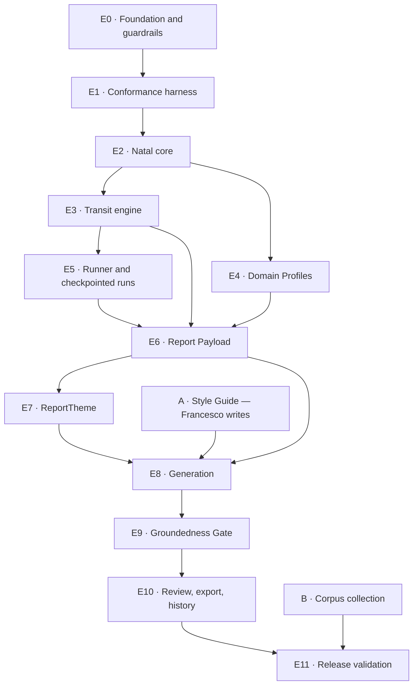

# Build Order — astro-report

How the v1 work splits into buildable chunks and in what order, keyed to PRD §14 and the FR numbers.
Every chunk names the `AD`s that govern it, so a story written from this document can cite them.

This is a **starting order, adapted from PRD §14**, not a replacement for it. Three deviations are
marked ⚠ where the architecture made a different sequence better; each says why.

Two tracks run in parallel from day one and are drawn detached because nothing blocks them: **A**, the
Style Guide, is writing rather than engineering; **B**, Corpus collection, is gathering.

---

## E0 · Foundation and the two guardrails

**Realizes:** FR-28, FR-29 · **Governed by:** AD-1, AD-2, AD-11, AD-15, AD-18

First, because everything after it stores identifiable Client data — PRD §14 step 0 — and because the
two mechanical guardrails are worth nothing if retrofitted.

- Repository, `uv`, Docker image, Render service, Neon project (Europe/Frankfurt), Alembic wired.
- `core/` and `shell/` skeleton, and **`tests/test_import_boundary.py` asserting `core/` imports
  nothing from `shell/`** — AD-1 is a rule only while this test exists.
- Vendored `sepl_18.se1` and `semo_18.se1`, `swe.set_ephe_path()` at startup, **SHA-256 assertion that
  refuses to boot on mismatch** (AD-2). Take the checksums from the files you actually download.
- `shell/config.py` as the single environment reader; single Argon2 hash plus signed session cookie
  (AD-15); the all-routes-authenticated test.
- `data/computation.toml` — orbs, house system, body sets, Ruler tables, the FR-13 harmonic table
  (AD-18). It holds no logic yet; it exists so nothing downstream invents a second home for these.
- Client deletion (FR-29) as a real cascade.

**Done when:** the app boots on Render against Neon, refuses to boot with a tampered ephemeris file,
returns no data unauthenticated, and the import-boundary test is green in CI.

---

## E1 · Conformance harness ⚠

**Realizes:** the mechanism behind SM-3 · **Governed by:** AD-2, AD-18

⚠ **Deviation from PRD §14, which places validation last (step 8).** Build the harness *before* the
computation it validates. The fixtures are the only external check that any of the astronomy is right,
and finding a Placidus error in week two is a fix while finding it in week ten is a rewrite of
everything layered on top. The harness ships empty and fills as E2 and E3 land.

- `tests/conformance/fixtures/` plus the runner that walks them.
- Francesco transcribes the reference charts from Astro.com. Choose them **adversarially**: a leap-day
  birth; births minutes either side of a historical DST switch; a near-midnight birth; a month
  containing a retrograde station; a month with two lunations of one kind, and one with none.

**Done when:** the runner executes against an empty fixture set in CI, and at least three transcribed
charts exist. **This chunk needs Francesco, not a developer.**

---

## E2 · Natal core

**Realizes:** FR-1, FR-2, FR-3, FR-4 · **Governed by:** AD-1, AD-2, AD-12, AD-16, AD-18

- Geocoding through Nominatim with the Postgres-backed cache; `timezonefinder` for the IANA zone and
  `zoneinfo` for the offset **in force at the birth instant** — historical, not present-day.
- `core/ephemeris/`: positions, Placidus cusps, Lunar Nodes, natal Aspects at the ±7.0° default.
- The Client stores its own immutable snapshot of coordinates and zone (AD-16). No optional birth
  fields, no partial constructor, no degraded path.
- FR-4 correction flow, with the warning and with prior Payloads retained against the superseded chart.

**Done when:** natal fixtures pass conformance, and a Client cannot be persisted in a partial state.

---

## E3 · Transit engine

**Realizes:** FR-8, FR-9, FR-10, FR-11, FR-12 · **Governed by:** AD-1, AD-2, AD-12, AD-18

- Continuous scan; bisection to the exact instant of Aspect Perfections, Stations, Ingresses and
  Lunations. The transiting Moon is excluded from Aspects and enters only through Lunations.
- The analyzed month as **one half-open UTC interval** derived from the Client's local calendar
  boundaries — every event belongs to exactly one Report (AD-12).
- Repeated cusp crossings from retrograde motion; in-orb-but-never-perfect Aspects flagged.

**Done when:** transit fixtures pass conformance, and the same chart and month produce an identical
event set on repeated runs.

---

## E4 · Domain Profiles

**Realizes:** FR-6, FR-7 · **Governed by:** AD-1, AD-18

Independent of E3 — buildable in parallel by whoever is free. Traditional and modern Ruler resolution
for all twelve cusps from the `computation.toml` tables; the four Profiles assembled as a pure
function. Names stay Italian and lowercase throughout.

**Done when:** the same Natal Chart yields byte-identical Profiles, asserted by test.

---

## E5 · Runner and checkpointed runs

**Realizes:** the mechanism behind FR-19, FR-21 · **Governed by:** AD-10, AD-9, AD-11

Introduced once two real stages exist, so everything after it slots into a frame rather than being
retrofitted into one.

- The `ReportRun` row, the forward-only stage sequence, per-stage persistence, resume-at-first-
  incomplete, idempotent stage functions.
- Bounded backoff sized for Gemini's 10 RPM ceiling; **no provider failover** (AD-9).
- The HTMX polling view over run status.

**Done when:** killing the process mid-run and re-driving resumes at the last good stage and recomputes
nothing that already succeeded.

---

## E6 · Report Payload

**Realizes:** FR-13, FR-14, FR-15 · **Governed by:** AD-3, AD-4, AD-5, AD-13, AD-18

The correctness spine. Nothing downstream may introduce an astronomical fact.

- Assembly per Section via `data/sections.toml` (AD-13) — a mapping, never a branch.
- Content-derived entry IDs (AD-4), canonical JSON, byte-identity asserted by test.
- **The Sections 6 and 7 day-lists projected from the Payload by pure code** (AD-5). The Generator
  never types a date here, so the misfiled-day error class cannot occur — structurally, and independent
  of the classification rule itself, which Francesco confirmed on 2026-08-14 (PRD Assumption 1).
- Schema version, `computation.toml` version and hash, and ephemeris identity recorded on every
  Payload. Immutable once its Report exists.
- FR-15's Payload-behind-the-Report view, reachable in one interaction (UJ-3).

**Done when:** identical inputs produce a byte-identical Payload across two machines, and every FR-13
Section receives exactly the material the PRD lists.

---

## E7 · ReportTheme ⚠

**Realizes:** FR-18's input · **Governed by:** AD-14, AD-3

⚠ **Deviation from PRD §14, which places memory at step 5, after generation.** `ReportTheme` is a pure
function of the Payload and is an *input* to generation under AD-3, so it must exist before E8 rather
than after — otherwise the Generator port signature changes once generation is already built.

Dominant slow-planet aspects by tightness, lunation houses, standing retrogrades. Comparing two
ReportThemes is what makes "nothing significant has changed" a computed fact.

**Done when:** two Themes for consecutive months diff into still-active / tightened / resolved / new,
deterministically.

---

## Track A · The Style Guide *(starts day one, blocks E8)*

**Realizes:** FR-30, FR-17 · **Governed by:** AD-19

**PRD §12 names this the highest-risk item in the build, and it is the one deliverable engineering
cannot produce.** SM-2 rests on how well it is written. It is writing work and can start immediately;
it blocks E8 and nothing else.

Francesco writes: register and address to the reader; sentence rhythm and length habits; vocabulary
used and avoided; how a claim is anchored to its transit and date; and each Section's interpretive
territory (`addendum.md` §8 is the starting material). The engineering half is small — versioned rows,
a text editor in the UI, prior versions retained, the version recorded on every Report (AD-19).

---

## E8 · Generation

**Realizes:** FR-16, FR-17, FR-19 · **Governed by:** AD-3, AD-6, AD-9, AD-19

- The Generator port takes exactly Payload, Style Guide version, previous and current ReportTheme
  (AD-3). No database handle, no tools, no prior Report prose.
- It returns **cited structure** — sentences carrying Payload entry IDs (AD-6). The shell renders them
  into continuous prose, keeping FR-16's no-bullet-fragments rule.
- Eight Sections, fixed order, Italian only, non-fatalistic, speakable.
- A recorded-response adapter for local development so building costs no quota.

**Done when:** a real Client produces eight Sections in Francesco's register, every astronomical
sentence carries citations, and Sections 6 and 7 contain no model-written date.

---

## E9 · Groundedness Gate

**Realizes:** FR-20, FR-21, FR-22 · **Governed by:** AD-5, AD-6, AD-7, AD-8

- `core/gate/vocabulary.it.json` — the closed Italian vocabulary, versioned (AD-8).
- `run_gate(draft, payload) -> GateResult`: pure, no model, no I/O (AD-7).
- Bounded **whole-Report** regeneration (AD-10); on persistent failure, show Francesco the Report, the
  failing Claims and the Payload entries they contradict — never a silent discard.
- Store pass/fail, regeneration count and flagged Claims (FR-22), which is where SM-5 and SM-7 are
  answered from.

**Done when:** a deliberately corrupted draft fails on every injected class — invented body, wrong
date, wrong house, false retrograde — and no path reaches export without a passed `GateResult`.

---

## E10 · Review, export and history

**Realizes:** FR-5, FR-25, FR-26, FR-27 · **Governed by:** AD-7, AD-17

- Report review with the Payload alongside and the Gate result visible.
- Chart wheel (FR-5), rendered in the shell, never reachable from an export.
- PDF and Markdown export of eight Sections and the Client name only — no wheel, no Payload, no
  metadata. Send disposition and elapsed time captured in one interaction (the measurement sources for
  SM-1 and SM-2).
- Report History (FR-27).
- **The operator backup route and its staleness warning (AD-17)** — the durability requirement is not
  met until this exists and a restore has actually been exercised.

**Done when:** forty reports can be produced, reviewed and exported in one sitting, and a full export
has been restored into an empty database successfully.

---

## Track B · Corpus collection *(starts day one, gates nothing in v1)*

**Realizes:** FR-23, FR-24 · **Governed by:** AD-11

Ingest past reports as text; mark each paired or unpaired; report the counts. The count is the decision
input for whether phase-2 few-shot conditioning is viable. Gathering is Francesco's work and is
expected to be slow; nothing in v1 waits on it.

---

## E11 · Release validation

**Realizes:** PRD §14 step 8 · **Governed by:** AD-2, AD-17

- SM-3: 100% conformance across the full adversarial fixture set.
- Re-verify the Gemini data terms against the current published terms before real Client data is sent
  (PRD §6.2) and record the check.
- Measure and record what the PRD only assumed: real per-report p90 latency against the 3-minute
  budget (Assumption 3), and the full-month scan against the 10-second bound (Assumption 4). Loosen the
  documented budgets if reality disagrees rather than leaving an unmet number in the PRD.
- Measure a real Report Payload and project it against Neon's 0.5 GB ceiling.
- Restore-from-export rehearsal.

---

## The critical path

**E0 → E1 → E2 → E3 → E6 → E8 → E9 → E10.** E4 parallelizes with E3; E5 and E7 are small; Tracks A and
B are Francesco's and run alongside everything.

Two chunks depend on Francesco rather than on a developer, and both sit on the critical path — **E1's
transcribed reference charts** and **Track A's Style Guide**. Starting them on day one is the single
highest-leverage scheduling decision in this build.
